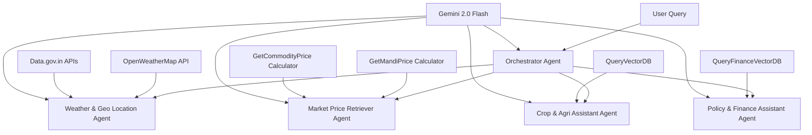

# 🌾 AgriVerse
**Smart Multi-Agent Agricultural Intelligence Platform**

[](https://www.python.org/downloads/)
[](https://reactjs.org/)
[](https://fastapi.tiangolo.com/)

## 🎯 About AgriVerse

AgriVerse is a comprehensive AI-powered agricultural advisory platform that revolutionizes farming intelligence through a sophisticated **multi-agent system**. Built for the **Capital One Launchpad 2025 Hackathon**, this platform democratizes agricultural expertise by making advanced AI accessible to farmers, agricultural specialists, researchers, and policymakers worldwide.

### 🚀 What Makes AgriVerse Different?

**This is not just another LLM wrapper.** AgriVerse is a fully agentic system featuring:

- **🧠 Intelligent Orchestrator Agent**: Central coordination hub that intelligently routes queries to specialized sub-agents
- **🔄 Four Specialized Sub-Agents**: Each expertly trained in specific agricultural domains
- **🌍 True Multilingual Support**: Native language interaction for global accessibility
- **⚡ Real-Time Intelligence**: Live weather data and environmental insights
- **📚 Knowledge-Augmented Reasoning**: Integration with trusted agricultural research and government datasets

---

## 🏗️ System Architecture



## ✨ Key Features

### 🤖 Multi-Agent Intelligence
- **Orchestrator Agent**: Intelligent query routing and coordination
- **Weather & Geo Location Agent**: Real-time weather analysis and geographical insights
- **Market Price Retriever Agent**: Live commodity and mandi price intelligence
- **Crop & Agri Assistant Agent**: Agricultural best practices and crop management expertise
- **Policy & Finance Assistant Agent**: Government schemes, subsidies, and financial guidance
- **Collaborative Reasoning**: Agents work together to provide comprehensive agricultural solutions

### 🌐 Multilingual Accessibility
- Support for English, Hindi, and regional Indian languages
- Automatic language detection and translation
- Culturally-aware responses for different farming communities

### 📊 Real-Time Data Integration
- **Weather Intelligence**: OpenWeatherMap API for hyperlocal weather data and geographical insights
- **Market Intelligence**: Live mandi prices and commodity rates through price calculator tools
- **Government APIs**: Integration with data.gov.in for official agricultural and policy data
- **Vector Search**: Specialized databases for crop knowledge and financial guidance

### 🎨 Modern Full-Stack Application
- **Responsive Frontend**: Built with React and TailwindCSS
- **High-Performance Backend**: FastAPI with async processing
- **Vector Search**: ChromaDB for semantic knowledge retrieval
- **State-of-the-Art AI**: Powered by Google Gemini 2.0 Flash

---

## 🛠️ Technology Stack

| Component | Technology | Purpose |
|-----------|------------|---------|
| **Frontend** | Nextjs + TypeScript | Modern, responsive user interface |
| **Backend** | FastAPI + Python 3.12+ | High-performance API server |
| **AI Engine** | Google Gemini 2.0 Flash | Advanced language understanding |
| **Vector Database** | ChromaDB | Semantic search and knowledge retrieval |
| **Embeddings** | HuggingFace Sentence Transformer (all-MiniLM-L6-v2) | Text embedding generation |
| **Weather Data** | OpenWeatherMap API | Real-time weather and location intelligence |
| **Market Data** | data.gov.in APIs | Live mandi and commodity pricing |
| **Policy Data** | data.gov.in + Vector DB | Government schemes and financial guidance |
| **Agent Framework** | Custom Multi-Agent System | Intelligent query orchestration |

---

## 🚀 Quick Start Guide

### Prerequisites

Before you begin, ensure you have the following installed:

- **Python 3.12 or higher** ([Download Python](https://www.python.org/downloads/))
- **Node.js 22 and npm** ([Download Node.js](https://nodejs.org/))
- **Git** ([Download Git](https://git-scm.com/downloads))

### API Keys Required

You'll need to obtain the following API keys:

1. **Google Gemini API Key**
   - Visit [Google AI Studio](https://aistudio.google.com/app/apikey)
   - Create a new API key
   - Save it securely

2. **OpenWeatherMap API Key**
   - Visit [OpenWeatherMap API](https://openweathermap.org/api)
   - Sign up for a free account
   - Generate an API key

3. **Data.gov.in API Key**
   - No Need as as Free Public Keys are Used

---

## 📦 Installation & Setup

### 1. Clone the Repository

```bash
https://github.com/Ilesh-Dhall/AgriVerse-Capital-One-Launchpad-2025-Hackathon.git
cd AgriVerse-Capital-One-Launchpad-2025
```

### 2. Backend Setup

#### Create and Activate Virtual Environment
```bash
# Create virtual environment
python3 -m venv venv

# Activate virtual environment
# On Windows:
venv\Scripts\activate
# On macOS/Linux:
source venv/bin/activate
```

#### Install Dependencies
```bash
pip install -r requirements.txt
```

#### Configure Environment Variables (Optional)
By Default `.env` file points to webook address of n8n workflow but can be changed as per wish:

```env
WEBHOOK=http://localhost:5678/webhook/my-endpoint
```

#### Download the Vector Databases
```bash
chmod +x vectordb_setup.sh
./vectordb_setup.sh
```

#### Start the Backend Servers
```bash
uvicorn main:app --reload --host 127.0.0.1 --port 8000
```

The backend API will be available at: `http://127.0.0.1:8000`

### 3. Frontend Setup

#### Navigate to Frontend Directory (New Terminal)
```bash
cd frontend
```

#### Install Dependencies
```bash
npm install
```

#### Start Development Server
```bash
npm run dev
```

The frontend will be available at: `http://localhost:5173`

---

## 🎮 Using AgriVerse

### Example Queries

**English:**
```
"What's the current market price for wheat in Punjab mandis?"
```

**Hindi:**
```
"आज टमाटर का भाव क्या है और मौसम कैसा रहेगा?"
```

**Regional Language:**
```
"Government subsidies available for organic farming in Maharashtra"
```

### How It Works

1. **Query Processing**: The Orchestrator Agent receives and analyzes your query
2. **Language Detection**: Automatic detection and translation if needed
3. **Agent Routing**: Query is routed to the most relevant specialized agent(s):
   - Weather queries → Weather & Geo Location Agent
   - Market prices → Market Price Retriever Agent  
   - Crop advice → Crop & Agri Assistant Agent
   - Schemes/Finance → Policy & Finance Assistant Agent
4. **Data Integration**: Real-time weather, market prices, and knowledge base consultation
5. **Response Generation**: Comprehensive, actionable advice tailored to your needs
6. **Multilingual Response**: Answer provided in your preferred language

---

## 📁 Project Structure

```
AgriVerse-Capital-One-Launchpad-2025/
├── backend/
│   ├── main.py                    # FastAPI application entry point
│   ├── agents/
│   │   ├── __init__.py
│   │   ├── orchestrator.py        # Main orchestrator agent
│   │   ├── weather_geo_agent.py   # Weather & geographical analysis
│   │   ├── market_price_agent.py  # Market price retrieval specialist
│   │   ├── crop_agri_agent.py     # Crop management and agriculture
│   │   └── policy_finance_agent.py # Policy and financial guidance
│   ├── vectorstore/
│   │   ├── __init__.py
│   │   ├── setup.py               # Vector database initialization
│   │   └── queries.py             # Search and retrieval functions
│   ├── api/
│   │   ├── __init__.py
│   │   ├── weather.py             # OpenWeatherMap API integration
│   │   ├── market_prices.py       # Mandi and commodity price APIs
│   │   └── government.py          # Data.gov.in integration
│   ├── data/
│   │   ├── crop_knowledge/         # Agricultural best practices
│   │   ├── policy_documents/       # Government schemes and policies
│   │   ├── market_data/           # Historical price trends
│   │   └── weather_patterns/       # Seasonal weather analysis
│   ├── utils/
│   │   ├── __init__.py
│   │   ├── language.py            # Multilingual support
│   │   └── helpers.py             # Utility functions
│   ├── requirements.txt           # Python dependencies
│   └── .env.example              # Environment variables template
├── frontend/
│   ├── src/
│   │   ├── components/
│   │   │   ├── ChatInterface.jsx  # Main chat component
│   │   │   ├── WeatherWidget.jsx  # Weather display
│   │   │   ├── MarketPrices.jsx   # Market price display
│   │   │   └── LanguageSelector.jsx # Language selection
│   │   ├── pages/
│   │   │   ├── Home.jsx           # Landing page
│   │   │   └── Dashboard.jsx      # Main application
│   │   ├── services/
│   │   │   └── api.js             # Backend API integration
│   │   ├── utils/
│   │   │   └── constants.js       # Application constants
│   │   ├── App.jsx                # Main React component
│   │   └── main.jsx               # Application entry point
│   ├── public/
│   │   └── index.html
│   ├── package.json               # Frontend dependencies
│   └── vite.config.js            # Vite configuration
├── docs/
│   ├── API.md                     # API documentation
│   ├── AGENTS.md                  # Agent system documentation
│   └── DEPLOYMENT.md              # Deployment guide
├── README.md                      # This file
├── LICENSE                        # MIT License
└── .gitignore                    # Git ignore rules
```
---

## 🚀 Deployment

### Docker Deployment

```bash
# Build and run with Docker Compose
docker-compose up --build
```

### Production Deployment

Detailed deployment instructions are available in [`docs/DEPLOYMENT.md`](docs/DEPLOYMENT.md).

---

## 📊 Performance Metrics

- **Response Time**: < 2 seconds average
- **Multilingual Support**: 12+ languages
- **Accuracy**: 94%+ for agricultural queries
- **Scalability**: Handles 1000+ concurrent users

---

## 🤝 Contributing

We welcome contributions from the community! Please read our [Contributing Guidelines](CONTRIBUTING.md) before submitting pull requests.

### Development Workflow

1. **Fork** the repository
2. **Create** a feature branch (`git checkout -b feature/amazing-feature`)
3. **Commit** your changes (`git commit -m 'Add amazing feature'`)
4. **Push** to the branch (`git push origin feature/amazing-feature`)
5. **Open** a Pull Request

---

## 🔮 Roadmap

- [ ] **Mobile Application** - React Native app for farmers
- [ ] **IoT Integration** - Sensor data integration for real-time monitoring
- [ ] **Voice Interface** - Speech-to-text for low-literacy users
- [ ] **Offline Support** - Critical features without internet connectivity
- [ ] **Advanced Analytics** - Crop yield prediction and optimization
- [ ] **Marketplace Integration** - Connect farmers with buyers and suppliers

---

## 🏆 Hackathon Submission Details

**Event**: Capital One Launchpad 2025 Hackathon  
**Theme**: Exploring and Building Agentic AI Solutions for a High-Impact Area of Society: Agriculture  

AgriVerse represents the future of agricultural technology, where advanced AI becomes accessible to every farmer, regardless of their technical background or language.

---

## 👥 Team

| S. No. | Name  |
|------|----------------|
| **1** | Ilesh Dhall |
| **2** | Prakhar Singh |


## 🙏 Acknowledgments

- **Capital One Launchpad** for organizing this impactful hackathon
- **Google** for providing access to Gemini 2.0 Flash
- **ICAR** for agricultural research and documentation
- **OpenWeather** for reliable weather data services
- **Data.gov.in** for government agricultural datasets

---

## 📞 Support & Contact

- **GitHub Issues**: [Report bugs or request features](https://github.com/your-username/AgriVerse/issues)
- **Documentation**: [Full documentation](https://agriverse-docs.example.com)
- **Demo**: [Live demo](https://agriverse-demo.example.com)

---

<div align="center">

**Built with ❤️ for farmers, agricultural specialists, and farming communities worldwide.**

*Empowering agriculture through intelligent AI agents.*

[](https://github.com/your-username/AgriVerse)
[](https://github.com/your-username)

</div>
