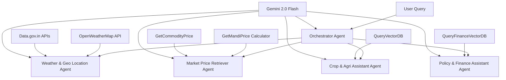

# 🌾 AgriVerse
**Smart Multi-Agent Agricultural Intelligence Platform**

[](https://n8n.io/)
[](https://www.python.org/downloads/)
[](https://reactjs.org/)
[](https://www.typescriptlang.org/)
[](https://fastapi.tiangolo.com/)
[](https://nodejs.org/)
## 🎯 About AgriVerse

AgriVerse is a comprehensive AI-powered agricultural advisory platform that revolutionizes farming intelligence through a sophisticated **multi-agent system**. Built for the **Capital One Launchpad 2025 Hackathon**, this platform democratizes agricultural expertise by making advanced AI accessible to farmers, agricultural specialists, researchers, and policymakers worldwide.

### 🚀 What Makes AgriVerse Different?

**This is not just another LLM wrapper.** AgriVerse is a fully agentic system featuring:

- **🧠 Intelligent Orchestrator Agent**: Central coordination hub that intelligently routes queries to specialized sub-agents
- **🔄 Four Specialized Sub-Agents**: Each expertly trained in specific agricultural domains
- **🌍 True Multilingual Support**: Native language interaction for global accessibility
- **⚡ Real-Time Intelligence**: Live weather data and environmental insights
- **📚 Knowledge-Augmented Reasoning**: Integration with trusted agricultural research and government datasets

---

## 🏗️ System Architecture



## ✨ Key Features

### 🤖 Multi-Agent Intelligence
- **Orchestrator Agent**: Intelligent query routing and coordination
- **Weather & Geo Location Agent**: Real-time weather analysis and geographical insights
- **Market Price Retriever Agent**: Live commodity and mandi price intelligence
- **Crop & Agri Assistant Agent**: Agricultural best practices and crop management expertise
- **Policy & Finance Assistant Agent**: Government schemes, subsidies, and financial guidance
- **Collaborative Reasoning**: Agents work together to provide comprehensive agricultural solutions

### 🌐 Multilingual Accessibility
- Support for English, Hindi, and regional Indian languages
- Automatic language detection and translation
- Culturally-aware responses for different farming communities

### 📊 Real-Time Data Integration
- **Weather Intelligence**: OpenWeatherMap API for hyperlocal weather data and geographical insights
- **Market Intelligence**: Live mandi prices and commodity rates through price calculator tools
- **Government APIs**: Integration with data.gov.in for official agricultural and policy data
- **Vector Search**: Specialized databases for crop knowledge and financial guidance

### 🎨 Modern Full-Stack Application
- **Responsive Frontend**: Built with React and TailwindCSS
- **High-Performance Backend**: FastAPI with async processing
- **Vector Search**: ChromaDB for semantic knowledge retrieval
- **State-of-the-Art AI**: Powered by Google Gemini 2.0 Flash

---

## 🛠️ Technology Stack

| Component | Technology | Purpose |
|-----------|------------|---------|
| **Frontend** | Nextjs + TypeScript | Modern, responsive user interface |
| **Backend** | FastAPI + Python 3.12+ | High-performance API server |
| **AI Engine** | Google Gemini 2.0 Flash | Advanced language understanding |
| **Pipelining** | Langchain | Simplifying Embedding and Vector Generation |
| **Vector Database** | ChromaDB | Semantic search and knowledge retrieval |
| **Embeddings** | HuggingFace Sentence Transformer (all-MiniLM-L6-v2) | Text embedding generation |
| **Weather Data** | OpenWeatherMap API | Real-time weather and location intelligence |
| **Market Data** | data.gov.in APIs | Live mandi and commodity pricing |
| **Policy Data** | data.gov.in + Vector DB | Government schemes and financial guidance |
| **Agent Framework** | n8n | Intelligent query orchestration |

---

## 🚀 Quick Start Guide

### Prerequisites

Before you begin, ensure you have the following installed:

- **Python 3.12 or higher** ([Download Python](https://www.python.org/downloads/))
- **Node.js 22 and npm** ([Download Node.js](https://nodejs.org/))
- **Git** ([Download Git](https://git-scm.com/downloads))

### API Keys Required

You'll need to obtain the following API keys:

1. **Google Gemini API Key**
   - Visit [Google AI Studio](https://aistudio.google.com/app/apikey)
   - Create a new API key
   - Save it securely

2. **OpenWeatherMap API Key**
   - Visit [OpenWeatherMap API](https://openweathermap.org/api)
   - Sign up for a free account
   - Generate an API key

3. **Data.gov.in API Key**
   - No Need as as Free Public Keys are Used

---

## 📦 Installation & Setup

### 1. Clone the Repository

```bash
git clone https://github.com/Ilesh-Dhall/AgriVerse-Capital-One-Launchpad-2025-Hackathon.git
cd AgriVerse-Capital-One-Launchpad-2025
```
### 2. Create Environment Configuration

Create a `.env` file in the root directory with the required webhook URL (leave default unless required):

```bash
# Create .env file
touch .env

# Add webhook configuration
echo "WEBHOOK=http://localhost:5678/webhook-test/my-endpoint" > .env
```

### 3. Backend Setup

#### Create and Activate Virtual Environment
```bash
# Create virtual environment
python3 -m venv venv

# Activate virtual environment
# On Windows:
venv\Scripts\activate
# On macOS/Linux:
source venv/bin/activate
```

#### Install Dependencies
**Note:** If you have **GPU** then change the **Pytorch version manually** in ```requirements.txt``` file. For Exact Version refer to [Pytorch Website](https://pytorch.org/get-started/locally).
```bash
pip install -r requirements.txt
```

#### Download the Vector Databases
```bash
chmod +x vectordb_setup.sh
./vectordb_setup.sh
```

To build it from scratch instead [refer here](#-manual-vector-database-setup-optional). (Optional)

#### Start the Backend Servers (RAG Vector Databases)
**In Terminal 1 (from root) run:**
```bash
cd backend/VectorDatabases/db_endpoints
python3 -m uvicorn query_service_icar:app --reload --host 127.0.0.1 --port 8000
```

The backend API will be available at: `http://127.0.0.1:8000`

**In Terminal 2 (from root) run:**
```bash
cd backend/VectorDatabases/db_endpoints
python3 -m uvicorn query_service_datagovin:app --reload --host 127.0.0.2 --port 8001
```

The backend API will be available at: `http://127.0.0.2:8001`

---
### 4. n8n Setup (Agent Workflow):

#### Install and Start n8n
In a new terminal in your home directory run:
```bash
npx n8n
```
This command will run a n8n instance locally without downloading all dependencies.

To get detailed instruction refer to [n8n official github repository](https://github.com/n8n-io/n8n).


#### Import AgriVerse Workflow
1. Open n8n at `http://localhost:5678`
2. Create a free n8n account (get free commercial license from settings)
3. Create a **blank workflow**
4. Click **three-dot menu** → **Import from file**
5. Select `AgriVerse-n8n-Workflow.json` from project root

#### Configure Credentials
1. **Google Gemini**: Click any Gemini node → Create New Credential → Add your API key
2. **OpenWeatherMap**: Click OpenWeatherMap node → Create New Credential → Add API key in Access Token field
3. **Activate the workflow** by clicking the toggle switch in menu bar

---

### 5. Frontend Setup 

#### Navigate to root Directory (New Terminal)
```bash
 cd AgriVerse-Capital-One-Launchpad-2025-Hackathon/
```

#### Install Dependencies
```bash
npm install
```

#### Start Development Server
```bash
npm dev
```

The frontend will be available at: `http://localhost:3000`

---

## 🎮 Using AgriVerse

### Example Queries

**English:**
```
What's the current market price for Tomato in Ludhiana Punjab mandis?
```

**Hindi:**
```
मुझे चावल की किस्मों के बारे में बताइए।
```

**Hinglish:**
```
Baarish wale mausum me kis type ki fasal achi rhegi?
```
**Punjabi:**
```
ਗੰਨੇ ਨੂੰ ਸਿੰਚਾਈ ਕਿਵੇਂ ਕਰਨੀ ਚਾਹੀਦੀ ਹੈ?
```
and many more...

### 🤔 How It Works 

1. **Query Processing**: The Orchestrator Agent receives and analyzes your query
2. **Language Detection**: Automatic detection and translation if needed
3. **Agent Routing**: Query is routed to the most relevant specialized agent(s):
   - Weather queries → Weather & Geo Location Agent
   - Market prices → Market Price Retriever Agent  
   - Crop advice → Crop & Agri Assistant Agent
   - Schemes/Finance → Policy & Finance Assistant Agent
4. **Data Integration**: Real-time weather, market prices, and knowledge base consultation
5. **Response Generation**: Comprehensive, actionable advice tailored to your needs
6. **Multilingual Response**: Answer provided in your preferred language

---


## 📊 Performance Metrics

- **Response Time**: < 10 seconds average
- **Multilingual Support**: 12+ languages
- **Reliability**: 100% sourced from government data.

---

## 🏆 Hackathon Submission Details

**Event**: Capital One Launchpad 2025 Hackathon
**Event URL:** capitalone.hackerearth.com  
**Theme**: Exploring and Building Agentic AI Solutions for a High-Impact Area of Society: Agriculture  

AgriVerse represents the future of agricultural technology, where advanced AI becomes accessible to every farmer, regardless of their technical background or language.


### 👥 Team

#### **Team Name:** NameError

| S. No. | Name  |
|------|----------------|
| **1** | [Ilesh Dhall](https://github.com/Ilesh-Dhall) |
| **2** | [Prakhar Singh](https://github.com/PrakharSinghOnGit) |

---

## 🔧 Manual Vector Database Setup (Optional)

If you prefer to build the vector databases from scratch instead of downloading pre-built ones, you can use the provided scripts. This process may take longer but gives you full control over the database creation.

### Prerequisites for Manual Setup
- Ensure you have all backend dependencies installed (`pip install -r requirements.txt`)
- Have sufficient disk space (the process may require several GB for processing documents)
- Stable internet connection for downloading source data

### Building the Databases

#### 1. ICAR Agricultural Knowledge Database
```bash
cd backend/VectorDatabases
python3 icar_vectordb_generate.py
```

This script will:
- Download and process ICAR agricultural research documents
- Generate embeddings using HuggingFace Sentence Transformer
- Create the ChromaDB vector database for crop and agricultural knowledge
- Store the database in the appropriate directory structure

#### 2. Data.gov.in Policy & Finance Database
```bash
cd backend/VectorDatabases
python3 datagovin_vectordb_generate.py
```

This script will:
- Fetch government policy and financial scheme data from data.gov.in APIs
- Process and clean the policy documents
- Generate embeddings for financial and policy content
- Create the ChromaDB vector database for government schemes and subsidies

### ⏱️ Expected Build Times
- **ICAR Database**: 15-30 minutes
- **Data.gov.in Database**: 5 minutes

### 🔍 Verification
After building, verify your databases are working:
```bash
# Test ICAR database
cd backend/VectorDatabases/db_endpoints
python3 -m uvicorn query_service_icar:app --reload --host 127.0.0.1 --port 8000

# Test Data.gov.in database (in another terminal)
python3 -m uvicorn query_service_datagovin:app --reload --host 127.0.0.2 --port 8001
```

Visit `http://127.0.0.1:8000/docs` and `http://127.0.0.2:8001/docs` to test the API endpoints.

**Note**: If you encounter any issues during manual setup, you can always fall back to the pre-built databases using the `vectordb_setup.sh` script.

---

## 🙏 Acknowledgments

- **Capital One Launchpad** for organizing this impactful hackathon
- **Google** for providing access to Gemini 2.0 Flash
- **ICAR** for agricultural research and documentation
- **OpenWeather** for reliable weather data services
- **Data.gov.in** for government agricultural datasets

---

<div align="center">

**Built with ❤️ for farmers, agricultural specialists, and farming communities worldwide.**

*Empowering agriculture through intelligent AI agents.*

[](https://github.com/Ilesh-Dhall/AgriVerse-Capital-One-Launchpad-2025-Hackathon.git)
[](https://github.com/Ilesh-Dhall)

</div>
